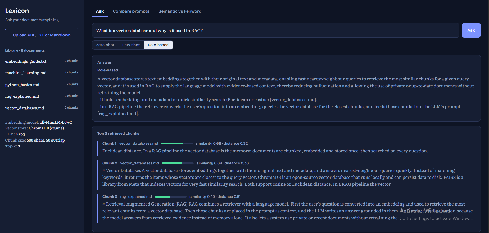
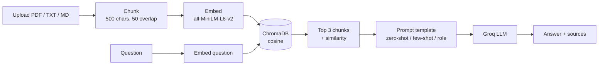

<div align="center">


# Lexicon

### AI-Powered Document Question Answering with RAG

Upload PDF, TXT or Markdown files, ask questions in plain language, and get answers grounded in your documents, with the exact source chunks shown beside every answer.

<a href="https://your-project.vercel.app"></a>
<a href="docs/report/Lexicon_Report.pdf"></a>
<a href="docs/presentation/Lexicon_Presentation.pptx"></a>
<a href="https://your-project.vercel.app/docs"></a>


<br>


<br>

[Features](#features) &nbsp;|&nbsp; [How it works](#how-it-works) &nbsp;|&nbsp; [Getting started](#getting-started) &nbsp;|&nbsp; [API](#api-reference) &nbsp;|&nbsp; [Deployment](#deployment) &nbsp;|&nbsp; [Limitations](#known-limitations)

</div>

---

## Overview

Language models write fluent answers but know nothing about your private files, and they sometimes invent facts. **Lexicon** fixes this with Retrieval-Augmented Generation (RAG): it finds the passages of your documents that best match a question, then asks the model to answer using only those passages.

The project was built as an assignment covering **prompt engineering, embeddings, vector databases and semantic search**, and includes a built-in experiment that compares three prompting techniques on the same questions.

<p align="center">
  
</p>

## Features

- **Document upload** for PDF, TXT and Markdown, with five sample documents indexed on first start
- **Semantic retrieval** of the top 3 chunks, shown with similarity score and distance
- **Three prompt styles** you can switch between: zero-shot, few-shot and role-based
- **Prompt comparison lab** that runs five questions through all three templates and scores every answer for accuracy, clarity and relevance with an LLM judge
- **Semantic vs keyword view** that shows both search results side by side for any query
- **Source transparency**: answers cite their files and the retrieved chunks are always visible
- **Responsive interface** with light and dark themes and no frontend dependencies

## How it works



| Stage | What happens |
|---|---|
| Chunk | Text is split at sentence or word boundaries into about 500 characters, with 50 characters of overlap so boundary sentences stay findable |
| Embed | Each chunk becomes a 384-dimensional vector using the `all-MiniLM-L6-v2` sentence-transformer (run through ONNX for a small install) |
| Store | Vectors, text and source metadata are saved in ChromaDB using cosine distance |
| Retrieve | The question is embedded with the same model and the 3 nearest chunks are returned. `distance = 1 - similarity` |
| Generate | The chunks are placed in a prompt and Groq writes the answer |

## Prompting techniques

Templates live in [`app/prompts/templates.py`](app/prompts/templates.py).

| Technique | Idea | Strength |
|---|---|---|
| **Zero-shot** | Task and context only, no examples | Simplest baseline |
| **Few-shot** | Three worked examples, one showing "answer not in the documents" | Consistent style and length |
| **Role-based** | A senior technical document analyst with strict rules: context only, answer first, cite sources | Grounded, verifiable answers |

The **Compare prompts** tab runs all three on the same five questions with identical retrieved chunks, so only the prompt differs. An LLM judge scores each answer from 1 to 10 for accuracy, clarity and relevance, and the tab shows per-question scores, averages and every full answer.

## Semantic vs keyword search

| | Keyword search | Semantic search |
|---|---|---|
| Matches on | Exact words | Meaning (embeddings) |
| "fix my car" finds "repairing an automobile" | No | Yes |
| Ranking | Count of shared words | Cosine similarity of vectors |
| Best for | Names, IDs, exact phrases | Natural-language questions |

## Tech stack

| Layer | Technology |
|---|---|
| Backend | Python, FastAPI |
| Embeddings | `sentence-transformers/all-MiniLM-L6-v2` via fastembed (ONNX) |
| Vector database | ChromaDB (persistent locally, in-memory on Vercel) |
| LLM | Groq (`openai/gpt-oss-20b` by default) |
| Frontend | HTML, CSS and JavaScript, no framework |
| Hosting | Vercel (backend and frontend), Firebase Hosting (optional frontend) |

## Project structure

```
lexicon-docqa/
├── api/
│   └── index.py              # Vercel entrypoint
├── app/
│   ├── main.py               # API routes
│   ├── config.py             # settings and environment
│   ├── schemas.py            # request models
│   ├── prompts/
│   │   └── templates.py      # zero-shot, few-shot, role-based
│   └── services/
│       ├── chunking.py       # text splitting
│       ├── embeddings.py     # sentence-transformer embeddings
│       ├── vector_store.py   # ChromaDB, semantic and keyword search
│       ├── llm.py            # Groq answers, retries, judge scoring
│       └── loaders.py        # PDF / TXT / MD readers
├── data/sample_docs/         # five sample documents
├── public/                   # frontend (index.html, css/, js/)
├── tests/                    # pytest suite
├── docs/                     # report, presentation, screenshots
├── vercel.json
├── firebase.json
├── requirements.txt
└── .env.example
```

## Getting started

### Prerequisites

- Python 3.10 or newer
- A free [Groq API key](https://console.groq.com/keys)

### Installation

```bash
git clone https://github.com/scientistayat-engineer/lexicon-docqa.git
cd lexicon-docqa

python -m venv venv
venv\Scripts\activate            # macOS / Linux: source venv/bin/activate
pip install -r requirements.txt
```

### Configuration

```bash
copy .env.example .env           # macOS / Linux: cp .env.example .env
```

Open `.env` and set your key:

```env
GROQ_API_KEY=your_groq_api_key_here
GROQ_MODEL=openai/gpt-oss-20b
CORS_ORIGINS=*
```

| Variable | Description | Default |
|---|---|---|
| `GROQ_API_KEY` | Your Groq API key (required) | none |
| `GROQ_MODEL` | Groq model used for answers and judging | `openai/gpt-oss-20b` |
| `CORS_ORIGINS` | Comma-separated allowed origins | `*` |

### Run

```bash
uvicorn app.main:app --reload
```

Open **http://127.0.0.1:8000**. The first start downloads the embedding model and indexes the sample documents, so allow a minute.

## Usage

1. **Ask**: type a question, choose a prompt style and read the answer together with the three retrieved chunks.
2. **Compare prompts**: edit the five questions if you like and click *Run comparison*. Groq's free tier limits tokens per minute, so the app waits and retries automatically and the run can take a few minutes.
3. **Semantic vs keyword**: enter any query to see what each search method finds.
4. **Upload**: add your own PDF, TXT or Markdown files from the sidebar.

## API reference

| Method | Endpoint | Description |
|---|---|---|
| GET | `/api/health` | Liveness check |
| GET | `/api/docs-list` | Indexed documents and chunk counts |
| POST | `/api/upload` | Upload and index files (multipart `files`) |
| POST | `/api/ask` | Body `{"question": "...", "mode": "zero_shot \| few_shot \| role_based"}` |
| GET | `/api/search?q=` | Semantic and keyword results for one query |
| POST | `/api/benchmark` | Body `{"questions": [...]}`, returns answers, scores and averages |

Interactive documentation is available at `/docs` while the server is running.

## Deployment

### Vercel (backend and frontend)

1. Push the repository to GitHub.
2. In Vercel choose **Add New > Project** and import the repository.
3. Add the environment variables `GROQ_API_KEY` and `GROQ_MODEL`, then deploy.

### Firebase Hosting (optional, frontend only)

Firebase Hosting cannot run Python, so the backend stays on Vercel.

1. Set `window.API_BASE = "https://<your-project>.vercel.app"` in `public/js/config.js`.
2. Run:

```bash
npm install -g firebase-tools
firebase login
firebase init hosting            # public directory: public, single-page app: No
firebase deploy
```

## Testing

```bash
pip install -r requirements-dev.txt
pytest
```

## Known limitations

- On Vercel the vector store is in memory. Sample documents are re-indexed on a cold start and uploads last only while the instance is warm.
- Uploads are limited to about 4.5 MB per request on Vercel.
- The first request after idle time is slow while the embedding model loads.
- The full prompt comparison is best run locally because of Groq rate limits and Vercel's function time limit.
- Scanned PDFs without a text layer are not supported (no OCR).
- Judge scores come from an LLM and are best used for relative comparison.

## Roadmap

- [ ] Persistent hosted vector database so uploads survive restarts
- [ ] Hybrid search combining keyword and semantic scores, with re-ranking
- [ ] Streaming answers
- [ ] Per-user document collections

## Documentation

- Technical report: [`docs/report/Lexicon_Report.pdf`](docs/report/Lexicon_Report.pdf)
- Presentation: [`docs/presentation/Lexicon_Presentation.pptx`](docs/presentation/Lexicon_Presentation.pptx)

## Author

**Anushay Ayat**, AI and Data Science, SMIT

## Contributing

Issues and pull requests are welcome. Please run `pytest` before opening a pull request and describe what you changed and how you tested it.

## License

Released under the [MIT License](LICENSE).

<div align="center">

If you found this project useful, please consider giving it a star.

<a href="https://github.com/scientistayat-engineer/lexicon-docqa"></a>

</div>